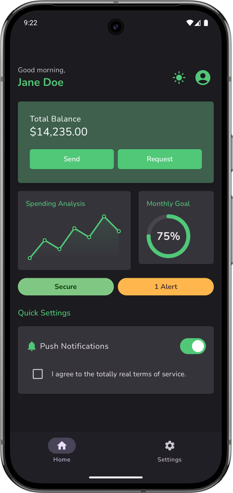
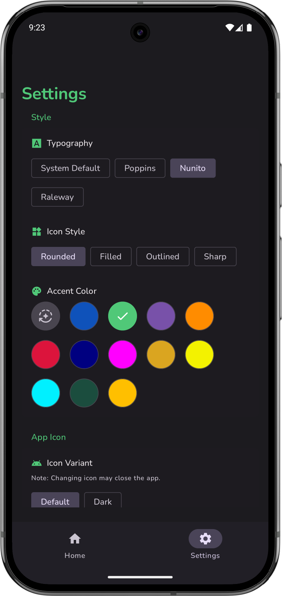

# 🎨 AuraComposeThemeKit: Modern Theming as a Service
[](https://jitpack.io/#vennamprasad/ComposeThemeKit)


**AuraComposeThemeKit** is a professional-grade, modular theming engine for Android Jetpack Compose. Unlike traditional static themes, AuraComposeThemeKit acts as a pluggable service that gives you total control over **Colors**, **Typography**, **Geometry**, **Haptics**, and **Animations** with zero boilerplate.

## 📸 Previews

<div align="center">
  
  &nbsp;&nbsp;&nbsp;&nbsp;
  
</div>

<br>

<div align="center">
  <b>Watch the Demo Video:</b><br>
  <a href="https://github.com/vennamprasad/ComposeThemeKit/raw/main/output/video.mp4">
    
  </a>
</div>

---

## 🚀 Key Features

- 🛠 **Dynamic Registry**: Register custom fonts, brand colors, and icon styles at runtime.
- 🎭 **Curated Profiles**: One-tap "Theme Profiles" (like *Cyberpunk*, *Nordic Forest*, *Retro Terminal*) that transform the entire app's look and feel.
- ⚡ **Auto-Scaling Components**: A suite of library components (`ThemeButton`, `ThemeCard`, `ThemeTextField`) that automatically respond to your theme's geometry and spacing rules.
- 📳 **Haptic Engine**: Built-in vibration feedback that scales with the selected "Haptic Intensity."
- 📊 **Themed Data Viz**: High-performance `ThemeLineChart` and `ThemeProgressCircle` that pull colors directly from your brand palette.
- 🌑 **True Black & High Contrast**: Native support for OLED-friendly dark modes and accessibility-first high-contrast elevations.

---

## 📦 Installation

**1. Add the JitPack repository to your root `settings.gradle.kts`:**

```kotlin
dependencyResolutionManagement {
    repositoriesMode.set(RepositoriesMode.FAIL_ON_PROJECT_REPOS)
    repositories {
        google()
        mavenCentral()
        maven { url = uri("https://jitpack.io") }
    }
}
```

**2. Add the dependency in your app's `build.gradle.kts`:**

```kotlin
dependencies {
    // Core Engine and UI Components
    implementation("com.github.vennamprasad.ComposeThemeKit:ComposeThemeKit-core-designsystem:1.0.4")
    
    // The pre-built Settings UI Screen
    implementation("com.github.vennamprasad.ComposeThemeKit:ComposeThemeKit-feature-settings-presentation:1.0.4")
}
```

> [!TIP]
> **Models Only**: If you only need the data models and registry without the UI components:
> `implementation("com.github.vennamprasad.ComposeThemeKit:ComposeThemeKit-core-model:1.0.4")`

---

## 🛠 Usage

### 1. Configure the Registry
Inject your custom branding assets on application startup:

```kotlin
AuraComposeThemeKit.configure {
    // Add a signature brand color
    colors.add(ThemeColor(id = "neon", name = "Cyber Neon", colorValue = 0xFF00FF00))
    
    // Register a custom font family
    fonts.add(ThemeFont(id = "inter", name = "Inter", fontRes = R.font.inter))
    
    // Create a curated custom skin
    profiles.add(ThemeProfile(
        id = "stealth",
        name = "Stealth Mode",
        config = ThemeConfig(isDarkTheme = true, isTrueBlack = true, brandColorId = "neon")
    ))
}
```

### 2. Use Theme-Aware Components
Place components in your UI that listen to the global `ThemeConfig` automatically:

```kotlin
@Composable
fun MyScreen() {
    Column {
        ThemeButton(onClick = { /* Haptics and shapes applied automatically! */ }) {
            Text("Launch App")
        }
        
        ThemeLineChart(dataPoints = listOf(10f, 50f, 30f)) // Colors match your branding
    }
}
```

---

## 🧩 Modular Architecture

AuraComposeThemeKit is built for large-scale production apps with a strictly decoupled architecture:

| Module | Description |
| :--- | :--- |
| `core:designsystem` | The main UI component library and Theme engine. |
| `core:model` | Logic-free data models and the `ThemeRegistry`. |
| `core:datastore` | Automated persistence for user theme preferences. |
| `feature:settings` | A full, ready-to-use settings screen with live previews. |

---

## 📄 License
AuraComposeThemeKit is available under the MIT License. See [LICENSE](LICENSE) for more details.

---
*Built with ❤️ for performance-oriented Android teams.*
